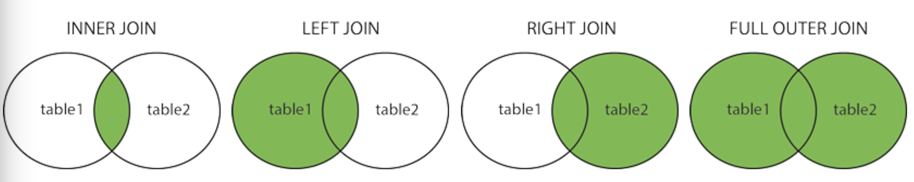

## SQL Joins
A JOIN clause is used to combine rows from two or more tables, based on a related column between them.

### Different Types of SQL JOINs
* (INNER) JOIN
Returns records that have matching values in both tables
* LEFT (OUTER) JOIN
Return all records from the left table, and the matched records from the right table
* RIGHT (OUTER) JOIN
Return all records from the right table, and the matched records from the left table
* FULL (OUTER) JOIN
Return all records when there is a match in either left or right table  

## References
[SQL Tutorial](https://www.w3schools.com/sql/default.asp) 
[SQL Joins](https://www.w3schools.com/sql/sql_join.asp) 
