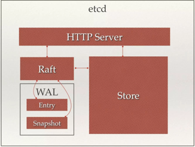

<!-- MarkdownTOC -->

- [etcd arch](#etcd-arch)
- [节点间数据传输 网络拓扑](#%E8%8A%82%E7%82%B9%E9%97%B4%E6%95%B0%E6%8D%AE%E4%BC%A0%E8%BE%93-%E7%BD%91%E7%BB%9C%E6%8B%93%E6%89%91)
- [节点间 数据类型和通道类型](#%E8%8A%82%E7%82%B9%E9%97%B4-%E6%95%B0%E6%8D%AE%E7%B1%BB%E5%9E%8B%E5%92%8C%E9%80%9A%E9%81%93%E7%B1%BB%E5%9E%8B)
- [Study notes](#study-notes)
  - [NoFreelistSync](#nofreelistsync)
- [References](#references)

<!-- /MarkdownTOC -->

# etcd arch



# 节点间数据传输 网络拓扑

1. 各节点间通过HTTP协议来传递数据
	* Leader向Follower 发送心跳包，Follower向Leader回复消息
	* Leader向Follower 发送日志追加信息
	* Leader向Follower 发送Snapshot数据
	* Candidate发起 选举，向其他node发起投票请求
	* Follower 将收的写操作转发给Leader

2. 任意两个nodes之间，建立 __长连接__ (网状结构), which is created during ETCD bootstrap. 
	* 减少创建连接的开销

# 节点间 数据类型和通道类型
有各种不同message，通过 __google protocol buffer__ 传输，size 各不相同:

| Message Type | 通道类型  | 通道类型 |
| ------------ | ------- |-------- |
| SNAPSHOT: even over 1GB | Stream   | 点到点1个HTTP长连接 |
| heartbeat: 几十 bytes    | Pipeline | 短连接传输，用完即关闭; 避免阻塞心跳包 |

# Study notes

## NoFreelistSync

```golang
// Do not sync freelist to disk. This improves the database write performance
// under normal operation, but requires a full database re-sync during recovery.
NoFreelistSync bool

```

https://coreos.com/blog/announcing-etcd-3.3

However, the free list sync demands more disk space and incurs extra latencies.

In one user's case, where there were lots of free pages due to frequent snapshots with read transactions, the database size quickly grew from 16 MiB to 4 GiB as a result of large freelist syncs.

# References

https://www.cnblogs.com/seattle-xyt/p/10366131.html
