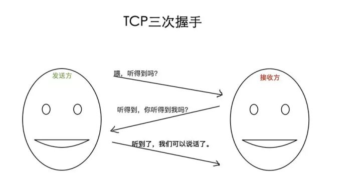
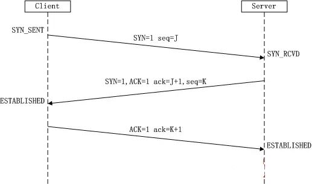
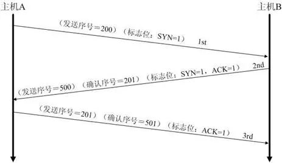
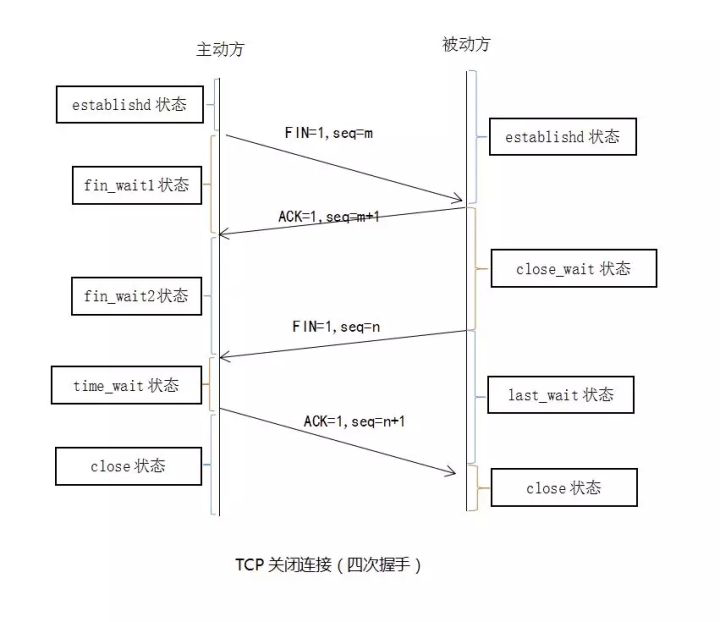
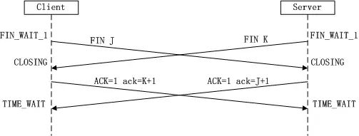

# Connection establishment
To establish a connection, TCP uses a three-way handshake.
* __SYN__: The active open is performed by the client sending a SYN to the server.
* __SYN-ACK__: In response, the server replies with a SYN-ACK.
* __ACK__: Finally, the client sends an ACK back to the server. 

### Why 三次
TCP建立连接为什么是三次握手，而不是两次或四次？
举个日常例子，打电话时我们对话如下：
<br/>

### Workflow
<br/>
### Example
<br/>

### SYN攻击
  在三次握手过程中，Server发送SYN-ACK之后，收到Client的ACK之前的TCP连接称为半连接（half-open connect），此时Server处于SYN_RCVD状态，当收到ACK后，Server转入ESTABLISHED状态。
  
  SYN攻击就是Client在短时间内伪造大量不存在的IP地址，并向Server不断地发送SYN包，Server回复确认包，并等待Client的确认，由于源地址是不存在的，因此，Server需要不断重发直至超时，这些伪造的SYN包将长时间占用未连接队列，导致正常的SYN请求因为队列满而被丢弃，从而引起网络堵塞甚至系统瘫痪。
  
  SYN攻击时一种典型的 __DDOS攻击__ ，检测SYN攻击的方式非常简单，即当Server上有大量半连接状态且源IP地址是随机的，则可以断定遭到SYN攻击了，使用如下命令可以让之现行：
```
# netstat -apn | grep SYN_RECV
```

# Connection termination
The connection termination phase uses a four-way handshake, with __each side of the connection terminating independently__. 
* FIN
* ACK
A typical tear-down requires a pair of FIN and ACK segments from each TCP endpoint.

<br/>

### 为什么建立连接是三次握手，而关闭连接却是四次挥手呢?

由于TCP连接时全双工的，因此，每个方向都必须要单独进行关闭，以确保 __数据能够完整传输__ 。
* 发送FIN signal，说明自己不会再发数据了。

这是因为服务端在LISTEN状态下，
* 收到建立连接请求的SYN报文后，
把ACK和SYN放在一个报文里发送给客户端。
* 而关闭连接时，当收到对方的FIN报文时，
仅仅表示 __对方不再发送数据了但是还能接收数据__ ，己方也未必全部数据都发送给对方了，所以己方可以立即close，也可以发送一些数据给对方后，再发送FIN报文给对方来表示同意现在关闭连接，因此，己方 __ACK报文和FIN报文__ 一般都会分开发送

上面是一方主动关闭，另一方被动关闭的情况，实际中还会出现同时发起主动关闭的情况，具体流程如下图：
<br/>


# References
[wiki/Transmission_Control_Protocol](https://en.wikipedia.org/wiki/Transmission_Control_Protocol)<br/>

[]()<br/>

[]()<br/>

[]()<br/>

[]()<br/>
