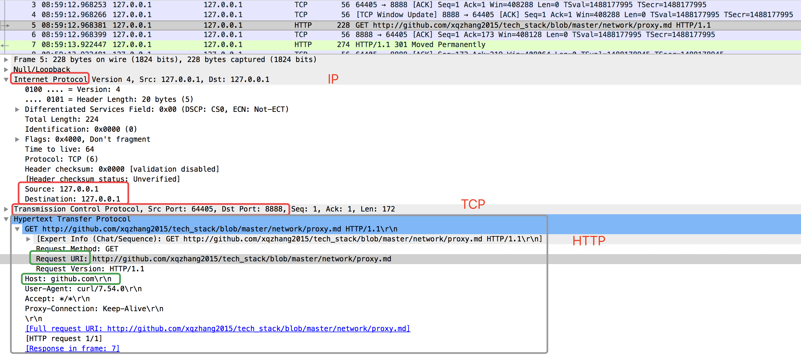

<!-- MarkdownTOC -->

- [3 Nginx 服务器架构初探](#3-nginx-%E6%9C%8D%E5%8A%A1%E5%99%A8%E6%9E%B6%E6%9E%84%E5%88%9D%E6%8E%A2)
  - [3.1 模块化结构](#31-%E6%A8%A1%E5%9D%97%E5%8C%96%E7%BB%93%E6%9E%84)
- [Nginx usage](#nginx-usage)
  - [Normal proxy: forward proxy](#normal-proxy-forward-proxy)
    - [nginx conf for forward proxy](#nginx-conf-for-forward-proxy)
    - [test: curl --proxy](#test-curl---proxy)
  - [Reverse proxy](#reverse-proxy)
- [References](#references)

<!-- /MarkdownTOC -->

# 3 Nginx 服务器架构初探
## 3.1 模块化结构
__模块化设计__: 以功能块为单位 进行程序设计，实现其求解算法的方法。
* 原则一: 功能块 单一职责原则
* 原则二: 自顶向下，逐步求精
* 原则三: 模块间依赖：`高内聚、低耦合原则`


# Nginx usage

`nginx -s reload|reopen|stop|quit`  #重新加载配置|重启|停止|退出 nginx

## Normal proxy: forward proxy
With client, to form a LAN.

### nginx conf for forward proxy

```sh
worker_processes  3;

events {
    worker_connections  1024;
}

http {
    server {
        listen       8888;
        server_name  localhost;

        location / {
            resolver 8.8.8.8;
            proxy_pass http://$http_host$uri;
        }
    }
}
```

### test: curl --proxy

Connecting to proxy first and then proxy server parsing the host and forward out.

```sh
curl -v --proxy 127.0.0.1:8888 http://github.com/xqzhang2015/tech_stack/blob/master/network/proxy.md
*   Trying 127.0.0.1...
* TCP_NODELAY set
* Connected to 127.0.0.1 (127.0.0.1) port 8888 (#0)
> GET http://github.com/xqzhang2015/tech_stack/blob/master/network/proxy.md HTTP/1.1
> Host: github.com
> User-Agent: curl/7.54.0
> Accept: */*
> Proxy-Connection: Keep-Alive
```

* tcpdump: proxy server

`sudo tcpdump -i lo0 -w test.pcap "port 8888"`



* Comparing, here is a direct http request:

```sh
Hypertext Transfer Protocol
    GET / HTTP/1.1\r\n
        [Expert Info (Chat/Sequence): GET / HTTP/1.1\r\n]
        Request Method: GET
        Request URI: /
        Request Version: HTTP/1.1
    Host: 61.135.169.121\r\n
    Connection: keep-alive\r\n
    Cache-Control: max-age=0\r\n
    Upgrade-Insecure-Requests: 1\r\n
    User-Agent: Mozilla/5.0 (Macintosh; Intel Mac OS X 10_13_4) AppleWebKit/537.36 (KHTML, like Gecko) Chrome/67.0.3396.99 Safari/537.36\r\n
    Accept: text/html,application/xhtml+xml,application/xml;q=0.9,image/webp,image/apng,*/*;q=0.8\r\n
    Accept-Encoding: gzip, deflate\r\n
    Accept-Language: en-US,en;q=0.9,zh-CN;q=0.8,zh;q=0.7\r\n
    Cookie: BD_HOME=0; BD_UPN=123253\r\n
    \r\n
    [Full request URI: http://61.135.169.121/]
    [HTTP request 1/1]
```

## Reverse proxy
With server, to form a LAN.
* Load balance
* Hide the existence and characteristics of an origin server or servers
* Application fire wall
* Caching: Reduce load on its origin servers by caching static content,


# References
[docs.nginx.com: admin-guide](https://docs.nginx.com/nginx/admin-guide/)<br/>

[]()<br/>

[]()<br/>

[]()<br/>

[]()<br/>

[]()<br/>

[]()<br/>

[]()<br/>

[]()<br/>

[]()<br/>

