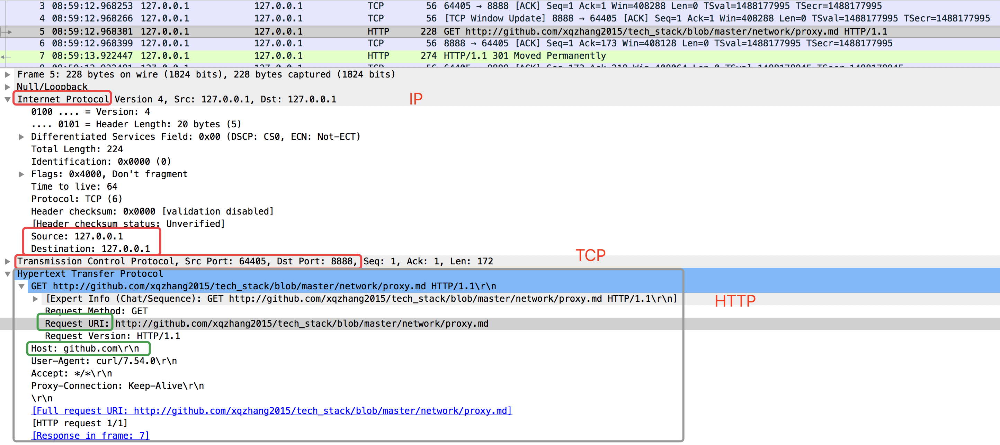

<!-- MarkdownTOC -->

- [Normal proxy: forward proxy](#normal-proxy-forward-proxy)
  - [nginx conf for forward proxy](#nginx-conf-for-forward-proxy)
  - [test: curl --proxy](#test-curl---proxy)
- [Reverse proxy](#reverse-proxy)

<!-- /MarkdownTOC -->
# Normal proxy: forward proxy
With client, to form a LAN.

## nginx conf for forward proxy

```sh
worker_processes  3;

events {
    worker_connections  1024;
}

http {
    server {
        listen       8888;
        server_name  localhost;

        location / {
            resolver 8.8.8.8;
            proxy_pass http://$http_host$uri;
        }
    }
}
```

## test: curl --proxy

Connecting to proxy first and then proxy server parsing the host and forward out.

```sh
curl -v -I --proxy 127.0.0.1:8888 www.baidu.com
* Rebuilt URL to: www.baidu.com/
*   Trying 127.0.0.1...
* TCP_NODELAY set
* Connected to 127.0.0.1 (127.0.0.1) port 8888 (#0)
> HEAD http://www.baidu.com/ HTTP/1.1
> Host: www.baidu.com
> User-Agent: curl/7.54.0
> Accept: */*
> Proxy-Connection: Keep-Alive
```

* tcpdump proxy server result



# Reverse proxy
With server, to form a LAN.
* Load balance
* Hide the existence and characteristics of an origin server or servers
* Application fire wall
* Caching: Reduce load on its origin servers by caching static content,
