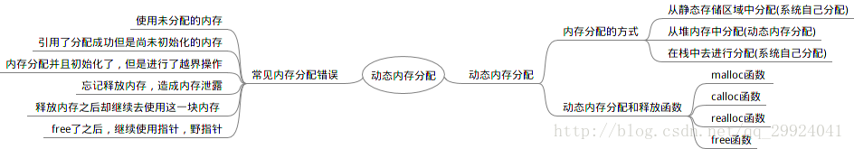

- [C Dynamic Memory](#c-dynamic-memory)
  - [Usage example](#usage-example)
  - [Type safety](#type_safety)
  - [Common errors](#common_errors)
  - [Implementations](#implementations)
    - [glibc dlmalloc](#glibc-dlmalloc)
    - [FreeBSD and NetBSD jemalloc](#freebsd-and-netbsd-jemalloc)
    - [Google tcmalloc](#google-tcmalloc)
    - [](#)
- [Timers](#timers)
  - [Some predefined signals](some-predefined-signals)
  - [Setting the alarm time](setting-the-alarm-time)
  - [More timer settings](more-timer-settings)
- [References](#references)
  
# C Dynamic Memory


C dynamic memory allocation: manually memory management for dynamic memory allocation in the C standard library, namely 
* malloc, -- allocates the specified number of bytes
* realloc, 
* calloc -- allocates the specified number of bytes and initializes them to zero
* and free.<br/>

In C++, operators __new__ and __delete__ are recommended by the language's authors.<br/>
The C programming language manages memory
* statically, -- allocated in main memory
* automatically, -- allocated on the stack
* or dynamically -- from the free store, called __heap__ <br/>

### Usage example
___
Creating an array of ten integers with automatic scope is straightforward in C:
```
int array[10];
```
However, the size of the array is fixed at compile time. <br/>
Allocate a similar array dynamically:
```
int *array = malloc(10 * sizeof(int));
if (array == NULL) {
  fprintf(stderr, "malloc failed\n");
  return -1;
}

array = realloc(array, 11 * sizeof(int));
array[10] = 13;

free(array);
```

### Type safety
---
__malloc__ returns a void pointer (void \*), which indicates that it is a pointer to a region of unknown data type. 
type casting:
```
int * ptr;
ptr = malloc(10 * sizeof(int));		/* without a cast */
ptr = (int *)malloc(10 * sizeof(int));	/* with a cast */
```
### Common errors
---
Most common errors are as follows:
##### Not checking for allocation failures
* Memory allocation is not guaranteed to succeed, and may instead return a null pointer.
##### Memory leaks
* __Failure(or forget)__ to deallocate memory using __free__ leads to waste memory resources.
##### Logical errors
All allocations must follow the same pattern:
* allocation using malloc,
* usage to store data,
* deallocation using free.

Failures to adhere to this pattern,
* memory usage after a call to free (__dangling pointer__)
** which is hard to debug,
** because freed memory is not immediately reclaimed by OS and may persist for a while and appear to work.
* memory usage before a call to malloc (__wild pointer__)
* calling free twice (__double free__) <br>
usually causes a segmentation fault and results in a crash of the program.

### Implementations
---
##### Heap-based
##### glibc dlmalloc
* dlmalloc ==> glibc(GNU C library)

##### FreeBSD and NetBSD jemalloc
[FreeBSD's and NetBSD's jemalloc](http://jemalloc.net/)
jemalloc is a general purpose malloc(3) implementation that emphasizes 
* fragmentation avoidance 
* and scalable concurrency support.

In order to avoid lock contention, jemalloc uses separate "arenas" for each CPU.

##### Google tcmalloc
[tcmalloc (Thread-caching malloc)](http://goog-perftools.sourceforge.net/doc/tcmalloc.html)
* A malloc developed by Google.
* Every thread has local storage for small allocations,
* Has garbage-collection for local storage of dead threads.

TCMalloc is faster than the glibc 2.3 malloc.

##### 

```
```

# [Timers](http://www.sm.luth.se/csee/courses/d0003e/lectures/lecture13.pdf)
### Some predefined signals
```
•SIGINT "interrupt" (Control-C)
•SIGILL illegal instruction (internal)
•SIGKILL kill process (can't be ignored)
•SIGALRM timer alarm
•SIGCHLD child process terminated
•SIGTSTP terminal stop (Control-Z)
•SIGUSR1 .. SIGUSR2
  • user defined
•SIGRTMIN .. SIGRTMAX
  • user defined (with extra data payload)
```

### Setting the alarm time
To set a timer to ring in one second, and thereafter every 50 milliseconds, write
```
struct itimerspec spec;
spec.it_value.tv_sec = 1;
spec.it_value.tv_nsec = 0;
spec.it_interval.tv_sec = 0;
spec.it_interval.tv_nsec = 50000000;
timer_settime( tmr, 0, &spec, NULL );
```

### More timer settings

To set a timer to ring just once, set the *it_interval* to 0
```
spec.it_value.tv_sec = 1;
spec.it_value.tv_nsec = 0;
spec.it_interval.tv_sec = 0;
spec.it_interval.tv_nsec = 0;
timer_settime( tmr, 0, &spec, NULL );
```
To temporarily disable a timer, set the *it_value* to 0
```
spec.it_value.tv_sec = 0;
spec.it_value.tv_nsec = 0;
spec.it_interval.tv_sec = 0;
spec.it_interval.tv_nsec = 50000000;
timer_settime( tmr, 0, &spec, NULL );
```

# References
[CSDN: 内存优化总结:ptmalloc、tcmalloc和jemalloc](https://blog.csdn.net/junlon2006/article/details/77854898)<br/>

[C语言中手把手教你动态内存分配](https://blog.csdn.net/qq_29924041/article/details/54897204)<br/>

[C++ 动态内存分配（6种情况，好几个例子）](https://www.cnblogs.com/findumars/p/5272691.html)<br/>
* 指针数组和数组指针
* 堆对象与构造函数
* 浅拷贝与深拷贝
* 拷贝赋值操作符

[Jianshu: ptmalloc/tcmalloc/jemalloc内存分配策略](https://www.jianshu.com/p/91d2956f22c1)<br/>

[blog.sina: Redis采用不同内存分配器碎片率对比](http://blog.sina.com.cn/s/blog_6f5b220601012x3x.html)<br/>
[]()<br/>
