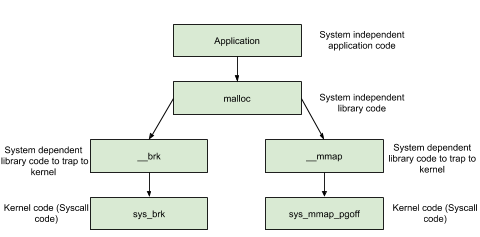

Every memory allocator claims they are ___fast, scalable and memory efficient___!! But not all allocators can be suited well for our application. 

<!-- MarkdownTOC -->

- [Available memory allocators](#available-memory-allocators)
  - [System Calls: used by malloc](#system-calls-used-by-malloc)
    - [brk](#brk)
    - [mmap](#mmap)
    - [how to check process memory mapping](#how-to-check-process-memory-mapping)
  - [Threading](#threading)
- [Arena](#arena)
  - [Number of arena's](#number-of-arenas)
  - [Multiple Arena](#multiple-arena)
    - [Example](#example)

<!-- /MarkdownTOC -->

# Available memory allocators

* dlmalloc – General purpose allocator
* ptmalloc2 – glibc: ptmalloc2 was forked from dlmalloc. After fork, threading support was added to it and it became the default memory allocator for linux.
* jemalloc – FreeBSD and Firefox
* tcmalloc – Google
* libumem – Solaris

## System Calls: used by malloc

___malloc___ uses syscalls to obtain memory from the OS. As shown in the below picture ___malloc___ invokes either brk or mmap syscall to obtain memory.



### brk

__brk__ obtains memory (non zero initialized) from kernel by increasing program break location (brk). 

Initially start (start_brk) and end of heap segment (brk) would point to same location.

* When ASLR is turned off, start_brk and brk would point to end of data/bss segment (end_data).
* When ASLR is turned on, start_brk and brk would be equal to end of data/bss segment (end_data) plus random brk offset.


### mmap

malloc uses __mmap__ to create a private anonymous mapping segment. The primary purpose of private anonymous mapping is to:
* allocate new memory (zero filled)
* this new memory would be exclusively used by calling process

### how to check process memory mapping

```sh
cat /proc/pid-xxx/maps

pmap -X pid-xxx
```

## Threading

Threading support helps in improving memory allocator performance and hence application performance.

* In __dlmalloc__ when two threads call malloc at the same time ONLY one thread can enter the critical section, since freelist data structure is shared among all the available threads. 
* While in __ptmalloc2__, when two threads call malloc at the same time memory is allocated immediately since each thread maintains a separate heap segment and hence freelist data structures maintaining those heaps are also separate.

This act of maintaining separate heap and freelist data structures for each thread is called __per thread arena__.


# Arena

## Number of arena's

* For 32 bit systems:

     Number of arena = 2 * number of cores.

* For 64 bit systems:

     Number of arena = 8 * number of cores.


## Multiple Arena

### Example
* 4 threads – Main thread + 3 user threads) runs on a 32 bit system which contains 1 core.
* Here no of threads (4) > 2\*no of cores (2).


