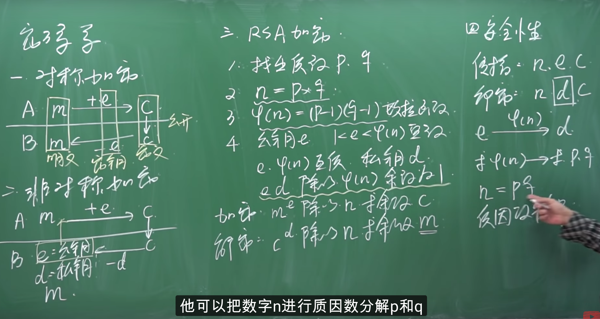
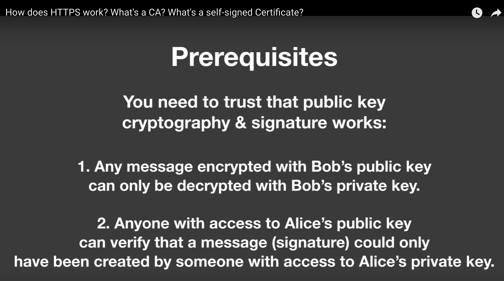
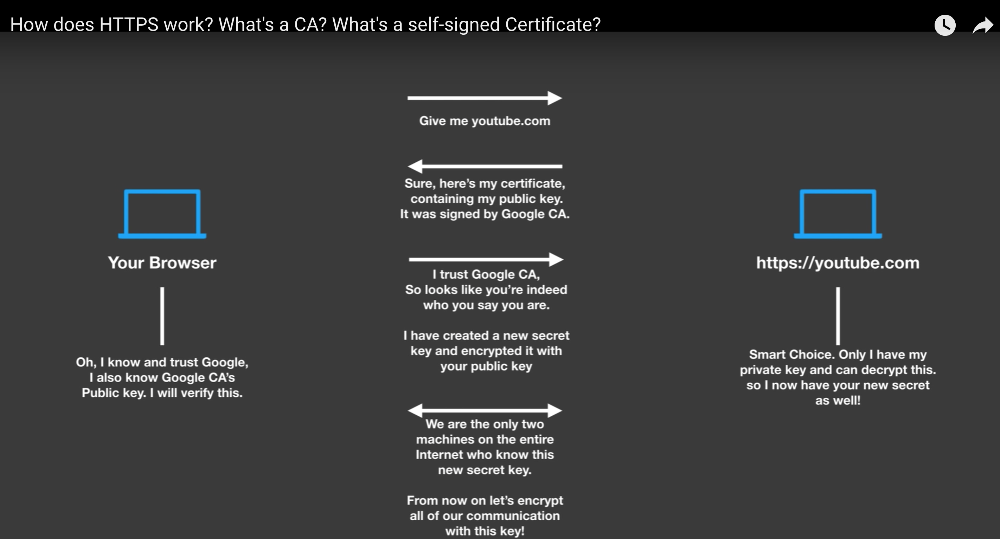
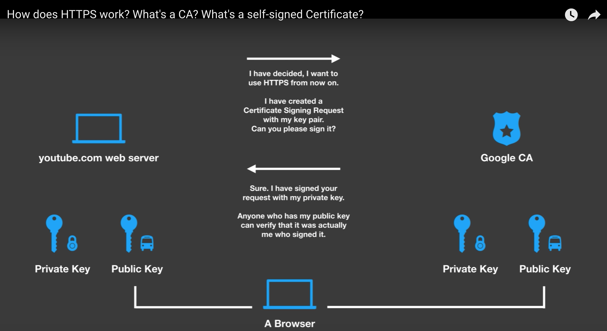
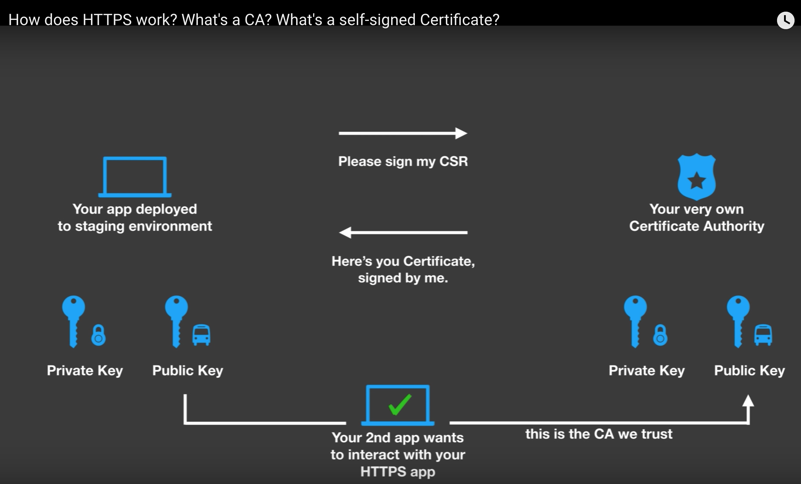

<!-- MarkdownTOC -->

- [Encrption](#encrption)
  - [对称加密\(symmetric encrption\)](#%E5%AF%B9%E7%A7%B0%E5%8A%A0%E5%AF%86symmetric-encrption)
  - [非对称加密\(asymmetric encrption\)](#%E9%9D%9E%E5%AF%B9%E7%A7%B0%E5%8A%A0%E5%AF%86asymmetric-encrption)
- [How does HTTPS work?](#how-does-https-work)
  - [public key and private key](#public-key-and-private-key)
  - [HTTPS: CA](#https-ca)
  - [HTTPS: self-signed certificate](#https-self-signed-certificate)
- [Example: etcd security](#example-etcd-security)
- [Reference](#reference)

<!-- /MarkdownTOC -->

# Encrption



## 对称加密(symmetric encrption)

## 非对称加密(asymmetric encrption)
* RSA 算法

# How does HTTPS work?

## public key and private key

* 非对称加密



## HTTPS: CA






## HTTPS: self-signed certificate



* Here is one-liner to verify a certificate chain:

```sh
openssl verify -verbose -x509_strict -CAfile ca.pem -CApath nosuchdir cert_chain.pem
```

# Example: etcd security

[etcd security](https://github.com/etcd-io/etcd/blob/master/Documentation/v2/security.md)<br/>

# Reference

[An Overview of How Digital Certificates Work](https://www.jscape.com/blog/an-overview-of-how-digital-certificates-work)<br/>

[stack overflow: How are ssl certificates verified?](https://stackoverflow.com/questions/188266/how-are-ssl-certificates-verified)<br/>

[online: certificate-decoder](https://www.sslshopper.com/certificate-decoder.html)<br/>

[online: RSA Encryption Decryption](https://8gwifi.org/RSAFunctionality?keysize=2048)<br/>

[TLS 1.3 Handshake: Taking a Closer Look](https://www.thesslstore.com/blog/tls-1-3-handshake-tls-1-2/)<br/>

[An Overview of TLS 1.3 – Faster and More Secure](https://kinsta.com/blog/tls-1-3/)<br/>

[wikipedia: In cryptography, X.509 is a standard defining the format of public key certificates.](https://en.wikipedia.org/wiki/X.509)<br/>

