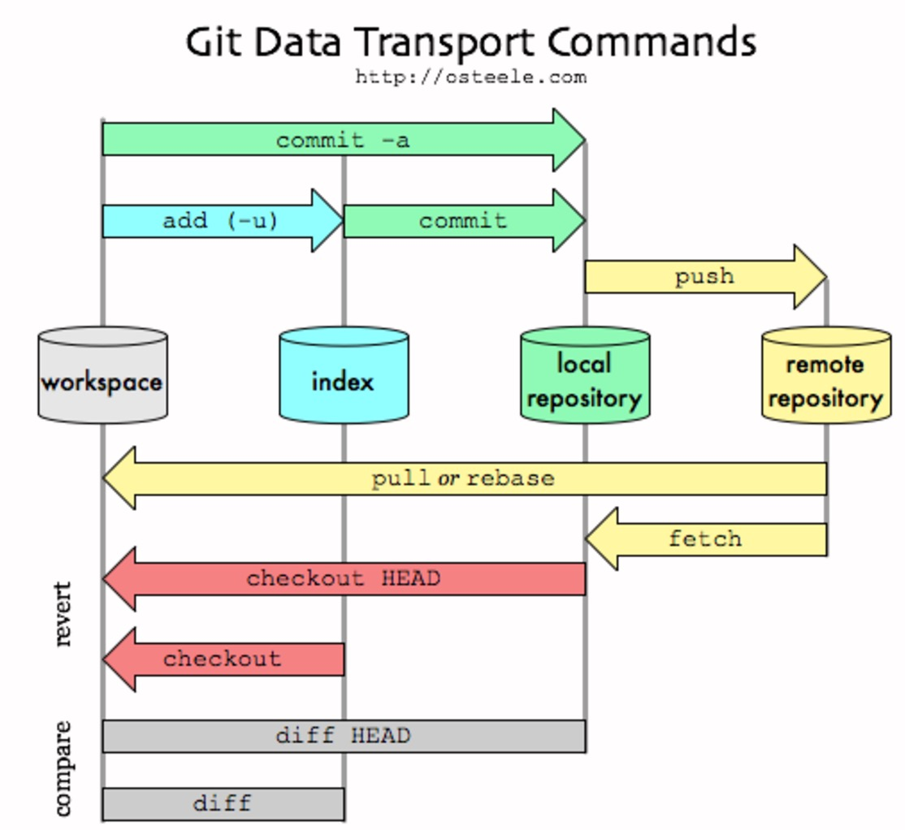

# Contents
- [Concepts](#Concepts)
  - [HEAD](#HEAD)
  - [git add](#git add)
  - [git diff](#git diff)
  - [git archive](#git archive)
  - [git log](#git log)
  - [git blame](#git blame)
  - [git reset](#git reset)
  - [git rebase](#git rebase)
  - [](#)
  - [](#)
  - [](#)
  - [](#)
  - [](#)

## Concepts
### HEAD
* HEAD is the latest commit object of the current active branch(working tree of local responsitory).<br/>

A head is simply a reference to a commit object. Each head has a name (branch name or tag name, etc). By default, there is a head in every repository called master. A repository can contain any number of heads. At any given time, one head is selected as the “current head.” This head is aliased to HEAD, always in capitals".<br/>

Note this difference: a “head” (lowercase) refers to any one of the named heads in the repository; “HEAD” (uppercase) refers exclusively to the currently active head. This distinction is used frequently in Git documentation.<br/>
* Example
```
➜  .git git:(ISP) cat HEAD
ref: refs/heads/ISP
➜  .git git:(ISP) cat refs/heads/ISP
869518d83aae0c99aa61a4c52ffa4c90d7c236c4
```

### git add
* NAME: git-add - Add file contents to the index
* SYNOPSIS
```
       git add [-n] [-v] [--force | -f] [--interactive | -i] [--patch | -p]
                 [--edit | -e] [--[no-]all | --[no-]ignore-removal | [--update | -u]]
                 [--intent-to-add | -N] [--refresh] [--ignore-errors] [--ignore-missing]
                 [--] [<pathspec>...]
```
* DESCRIPTION<br>
       This command updates the index using the current content found in the working tree, to prepare the content staged for the next commit.<br>
       The "index" holds a snapshot of the content of the working tree, and it is this snapshot that is taken as the contents of the next commit. Thus after making any changes to the working directory, and before running the commit command, you must use the add command to add any new or modified files to the index.<br>

* SYNOPSIS
```
    -u, --update          update tracked files
```

### git diff
* NAME<br>
git-diff - Show changes between commits, commit and working tree, etc
* EXAMPLES
```
       Various ways to check your working tree

               $ git diff            (1)
               $ git diff --cached   (2)
               $ git diff HEAD       (3)

           1. Changes in the working tree not yet staged for the next commit.
           2. Changes between the index and your last commit; what you would be committing if you run "git commit" without "-a" option.
           3. Changes in the working tree since your last commit; what you would be committing if you run "git commit -a"
	   
       Comparing with arbitrary commits
               $ git diff HEAD^ HEAD      (3)
           3. Compare the version before the last commit and the last commit.

```

### git archive
* NAME: git-archive - Create an archive of files from a named tree
* SYNOPSIS
```
       git archive [--format=<fmt>] [--list] [--prefix=<prefix>/] [<extra>]
                     [-o <file> | --output=<file>] [--worktree-attributes]
                     [--remote=<repo> [--exec=<git-upload-archive>]] <tree-ish>
                     [<path>...]
```
* EXAMPLES
```
➜  test git archive --remote=git@XXX:YYY/ZZZ.git HEAD:ads_metric/utils abc.json | tar -x
➜  test ls
abc.json

1) get a file in base/WHOLE_PLAYER.log
git archive --remote=git@XXX:YYY/ZZZ.git HEAD:base WHOLE_PLAYER.log | tar -x
2) get the base directory: 
git archive --remote=git@XXX:YYY/ZZZ.git HEAD:base | tar -x
3) get the base log WHOLE_PLAYER.log in branch V_6_11
git archive --remote=git@XXX:YYY/ZZZ.git V_6_11:base WHOLE_PLAYER.log | tar -x
```

### git log
Name: git-log - Show commit logs
SYNOPSIS: git log [<options>] [<revision range>] [[--] <path>...]
```
git log --graph  . | vim -
git log -3 --author=user-name .
git log -3 --pretty=format:%h
```
[pretty-formats](https://git-scm.com/docs/pretty-formats)
* '%h': abbreviated commit hash
* '%ae': author email
* '%p': abbreviated parent hashes
* '%ci': committer date, ISO 8601-like format

Example: check if anyone commits without ticket no. In ~/.zshrc:
```
git_test() {
	local arg=${1:-""}
	if [ "$arg"x != x ]; then
		cd $arg
	fi

	echo "==============================================="
	echo "Checking date: "`date`
	echo "==============================================="
	git log --after='2017-06-01' --before="2030-11-01" --pretty=format:"%s | %ae | %h | %ci" . | grep -v "^Merge \|^Revert \|^git-svn-id" | grep -v "^[ a-zA-Z]\{2,\}[-_]\{1\}[0-9]\{1,\}"

	if [ "$arg"x != x ]; then
		cd -
	fi
}
```

### git blame
-w will ignore whitespaces and -M will detect moved or copied lines.
```
git blame -w -M abc.cpp | vim -
```

### git reset
HEAD is the latest commit, and HEAD^ is 2nd latest commit.
```
git reset --soft HEAD
git reset --soft HEAD^
git reset --hard HEAD # this could be used to ignore merge conflict.
```
git reset --hard HEAD

### git rebase

Add main-repo as remote upstream
```
git remote add upstream git@123.com:a/main-repo.git
```
Get updates from remote upstream
```
git fetch upstream
git rebase upstream/master
```

```
NAME
       git-rebase - Reapply commits on top of another base tip
SYNOPSIS
       git rebase [-i | --interactive] [options] [--exec <cmd>] [--onto <newbase>]
               [<upstream> [<branch>]]
DESCRIPTION
       If <branch> is specified, git rebase will perform an automatic git checkout <branch> before doing anything else. Otherwise it remains on the current branch.

       If <upstream> is not specified, the upstream configured in branch.<name>.remote and branch.<name>.merge options will be used (see git-config(1) for details) and the --fork-point option is assumed. If you are currently not on any branch or if the current branch does not have a configured upstream, the rebase will abort.

       All changes made by commits in the current branch but that are not in <upstream> are saved to a temporary area. This is the same set of commits that would be shown by git log <upstream>..HEAD; or by git log 'fork_point'..HEAD, if --fork-point is active (see the description on --fork-point below); or by git log HEAD, if the --root option is specified.

       Assume the following history exists and the current branch is "topic":

                     A---B---C topic
                    /
               D---E---F---G master


       From this point, the result of either of the following commands:

           git rebase master
           git rebase master topic

       would be:

                             A'--B'--C' topic
                            /
               D---E---F---G master
```

## If auto-generated file is really generated automatically? 
### Limitation: only check the latest commit for a specific file

### Approach
```
bool is_auto_generated():
  1. git log -5 xxx/xxx.go
  2. if this last commit is a [revert] commit, skip checking this file for this time. return true.
  3. check if timestamp in file is after the 2nd-latest commit.
  4. if NOT true, return false.
  5. return true.
```

### Edge case
```
    Revert "Merge branch 'XXX' into 'YYY'"

    This reverts merge request !1234
```

### Git Data Transport Commands


### References
[Git fetch + merge, Git fetch + rebase, Git pull](https://tapaswenipathak.wordpress.com/2016/02/15/git-fetch-merge-git-fetch-rebase-git-pull/)<br/>

[Github blog: Reset Demystified](https://git-scm.com/blog)<br>
[Github: book(v2)](https://git-scm.com/book/en/v2)<br>
[Github: video](https://git-scm.com/videos)<br>
[Github: about](https://git-scm.com/about)<br>
