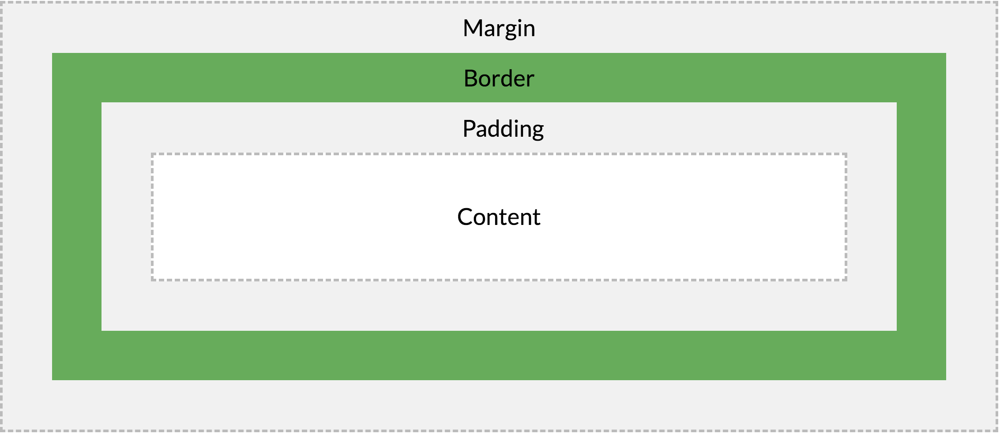

<!-- MarkdownTOC -->

- [CSS](#css)
  - [CSS Introduction: what is CSS?](#css-introduction-what-is-css)
  - [CSS Syntax and Selectors](#css-syntax-and-selectors)
    - [The element Selector](#the-element-selector)
  - [CSS Box Model](#css-box-model)
  - [\[\]\(\)](#)
  - [\[\]\(\)](#-1)
- [JavaScript](#javascript)
- [JavaScript HTML DOM](#javascript-html-dom)
  - [The HTML DOM \(Document Object Model\)](#the-html-dom-document-object-model)
  - [What is the HTML DOM?](#what-is-the-html-dom)
- [Rerferences](#rerferences)

<!-- /MarkdownTOC -->

# CSS
## [CSS Introduction: what is CSS?](https://www.w3schools.com/css/css_intro.asp)
* CSS stands for __Cascading Style Sheets__
* CSS describes how HTML elements are to be displayed on screen, paper, or in other media
* CSS saves a lot of work. It can control the layout of multiple web pages all at once
* External stylesheets are stored in CSS files

## [CSS Syntax and Selectors](https://www.w3schools.com/css/css_syntax.asp)
A CSS rule-set consists of a selector and a declaration block:

* The selector points to the HTML element you want to style.
* The declaration block contains one or more declarations separated by semicolons.
* Each declaration includes a CSS property name and a value, separated by a colon.

CSS selectors are used to "find" (or select) HTML elements based on their element name, id, class, attribute, and more.


### The element Selector
The element selector selects elements based on the element name.

You can select all <p> elements on a page like this (in this case, all <p> elements will be center-aligned, with a red text color):

* example

```html
<!DOCTYPE html>
<html>
<head>
<style>
p {
  color: red;
  text-align: center;
} 
</style>
</head>
<body>

<p>Hello World!</p>
<p>These paragraphs are styled with CSS.</p>

</body>
</html>
```


## [CSS Box Model](https://www.w3schools.com/css/css_boxmodel.asp)

All HTML elements can be considered as boxes. In CSS, the term "box model" is used when talking about design and layout.

The CSS box model is essentially a box that wraps around every HTML element. It consists of:
* margins, 
* borders,
* padding,
* and the actual content.

The image below illustrates the box model:



Explanation of the different parts:

* Content - The content of the box, where text and images appear
* Padding - Clears an area around the content. The padding is transparent
* Border - A border that goes around the padding and content
* Margin - Clears an area outside the border. The margin is transparent

* Example

```html
div {
  width: 300px;
  border: 25px solid green;
  padding: 25px;
  margin: 25px;
}
```

## []()

## []()

# JavaScript
* 提示：JavaScript 是脚本语言。浏览器会在读取代码时，**逐行地执行**脚本代码。而对于传统编程来说，会在**执行前对所有代码进行编译**。

# JavaScript HTML DOM
With the HTML DOM, JavaScript can access and change all the elements of an HTML document.<br/>

## The HTML DOM (Document Object Model)
When a web page is loaded, the browser creates a Document Object Model of the page.<br/>
The HTML DOM model is constructed as a tree of Objects:<br/>
* The HTML DOM Tree of Objects<br/>
<br/>

With the object model, JavaScript gets all the power it needs to create dynamic HTML:<br/>
* JavaScript can change all the HTML elements in the page
* JavaScript can change all the HTML attributes in the page
* JavaScript can change all the CSS styles in the page
* JavaScript can remove existing HTML elements and attributes
* JavaScript can add new HTML elements and attributes
* JavaScript can react to all existing HTML events in the page
* JavaScript can create new HTML events in the page

## What is the HTML DOM?
The HTML DOM is a standard object model and programming interface for HTML. It defines:<br/>
* The HTML elements as objects
* The properties of all HTML elements
* The methods to access all HTML elements
* The events for all HTML elements

In other words:<br>
**The HTML DOM is a standard for how to get, change, add, or delete HTML elements.**<br>
-- **增 / 删 / 改 / 查**


# Rerferences
[w3school JavaScript Tutorial(CN)](http://www.w3school.com.cn/js/index.asp)<br/>

[w3school JavaScript Tutorial(EN)](https://www.w3schools.com/js/default.asp)<br/>

[JavaScript Standard built-in objects](https://developer.mozilla.org/en-US/docs/Web/JavaScript/Reference/Global_Objects)<br/>

[微信小游戏初体验](https://segmentfault.com/a/1190000012646888)<br/>


